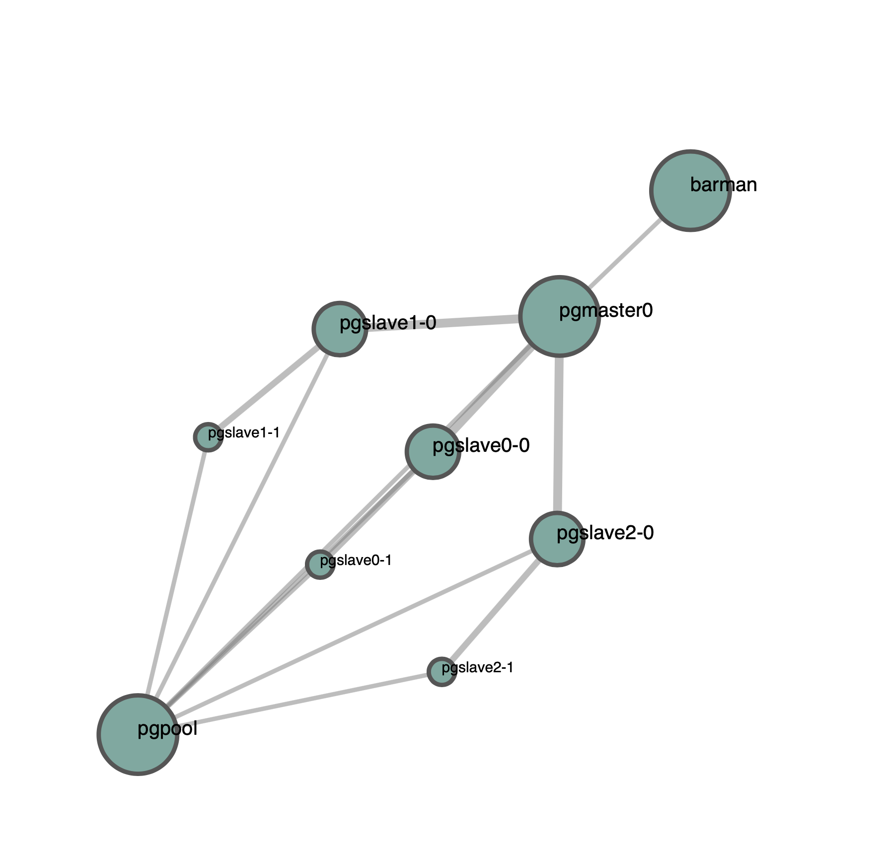
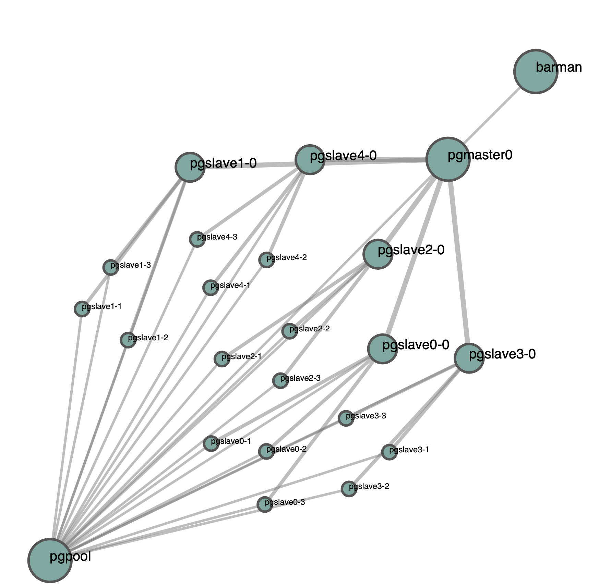
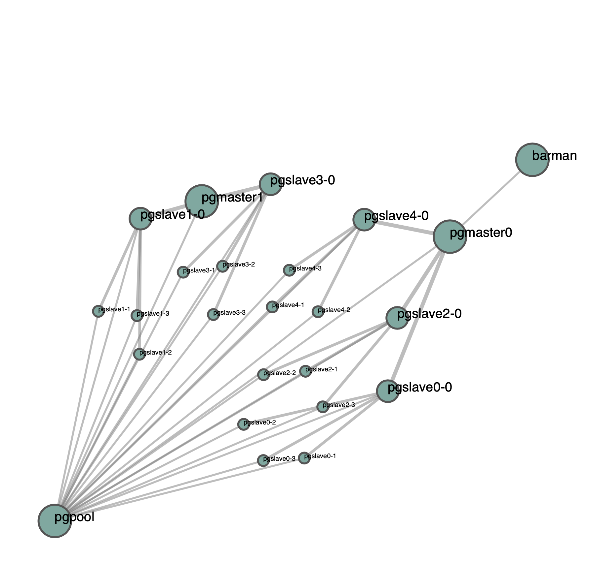

# Automation for docker-compose creation

This script automatically creates the docker compose `yaml` described by the settings.
The settings configuration is in the form:
```json
{
        "PG_VERSION": "11",
        "REPMGR_VERSION": "4.0",
        "PGPOOL_VERSION": "3.7",
        "BARMAN_VERSION": "2.4",
        "N_MASTERS": "1",
        "N_REPLICAS": "3",
        "REPLICA_SIZE": "2",
        "PG_DB": "monkey_db",
        "PG_USER": "monkey_user",
        "PG_PASSWORD": "monkey_pass",
        "REP_DB": "replication_db",
        "REP_USER": "replication_user",
        "REP_PASSWORD": "replication_pass",
        "PCP_USER": "pcp_user",
        "PCP_PASSWORD": "pcp_pass"
}
```
The number of masters can be modified.
The number of replications groups can be edited, as well as the group size. 
The main slave (id0) of each group is connected via stream to the master.
All the slaves and masters are connected to `pgpool`, which requires a quorum of at least `N_MASTERS + N_REPLICAS`, therefore treating the secondary slaves as active backups.

This automation can programmatically create all of the provided `yaml`s of the original repository, allowing for bigger deployments with ease.

:::warning
The config file is passed via `-c` or `--config`. By default the `settings.template.json` included in this directory will be used if not specified otherwise.
:::

:::danger
By default Barman is disabled. To enable it use the `-b` or `--barman` flag.
:::

## Visualization

In addition, in case `networkx, matplotlib` and `netwulf` are available, it is possible to obtain a visualization of the generated topology.

For example a configuration with 1 master, 3 replication groups with 2 slaves each appears to be as follows:


A configuration with 1 master, 5 replication groups with 4 slaves each as follows:


A configuration with 2 masters, 5 replication groups with 4 slaves each as follows:
